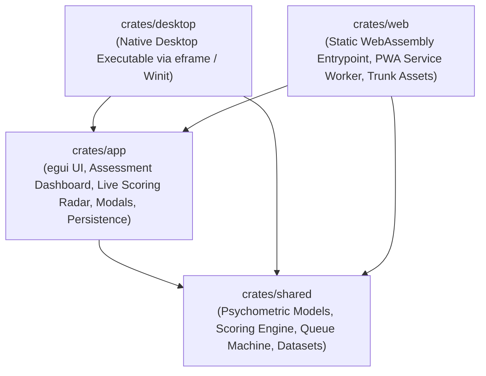

# Revisited IPIP-NEO Personality Assessment

[](https://github.com/Spodeian/Revisited-IPIP-NEO/actions/workflows/ci.yml)
[](https://github.com/Spodeian/Revisited-IPIP-NEO/actions/workflows/static.yml)
[](LICENSE)
[](https://www.rust-lang.org)
[](https://github.com/emilk/egui)
[](https://pages.cloudflare.com)

A modular, production-ready psychometric assessment application built with Rust and [`egui 0.36`](https://github.com/emilk/egui) targeting **Serverless Web (WASM / Cloudflare Pages / PWA)** and **Native Desktop (Windows, macOS, Linux)** platforms. It administers a comprehensive 221-item questionnaire using a mathematically optimized standard error reduction sequence.

---

## 🔬 Academic Reference

This implementation is based on the Taxonomic Graph Analysis (TGA) methodology detailed in the following publication:
- **Article**: Samo, A., Garrido, L. E., Abad, F. J., Golino, H., McAbee, S. T., & Christensen, A. P. (2026). *Revisiting the IPIP-NEO personality hierarchy with taxonomic graph analysis*. European Journal of Personality, 40(2), 369–390.
- **DOI**: [10.1177/08902070251352590](https://doi.org/10.1177/08902070251352590)
- **Open Science Framework (OSF)**: [https://osf.io/hwpa9](https://osf.io/hwpa9)

---

## 🏛️ Architectural Structure

The workspace is organized into four decoupled, single-responsibility crates:



- **[`crates/shared`](crates/shared)**: Core psychometric data models, CSV loaders, dynamic queue machine, scoring engine, and multi-format exporters (CSV, JSON, HTML, compressed BSON).
- **[`crates/app`](crates/app)**: `eframe` GUI implementation (focused single-question dashboard, keyboard shortcuts, scroll skip deferral, real-time side-by-side results, export panels, and multi-tier state management).
- **[`crates/desktop`](crates/desktop)**: Native desktop application runner.
- **[`crates/web`](crates/web)**: WebAssembly client entrypoint (`wasm-bindgen`), HTML5 shell, Trunk asset bundling, and PWA service worker.

---

## ✨ Key Features

- **🎯 Dynamic Queue Mechanics**: Skips and defers questions (via mouse scroll or arrow keys) to the back of the queue, ensuring skipped items reappear at the end without data loss.
- **📊 Mathematically Robust Scoring Engine**: Computes exact raw scores, normalized construct averages, absolute weights, and standard error ($SE$) values for **3 Meta-Traits**, **6 Traits**, and **28 Facets**.
- **💾 Resilient Multi-Tier State Persistence**:
  - **Dedicated Key Storage**: Persists state under dedicated key `revisited_ipip_neo_app_state` to prevent namespace collisions.
  - **Dual-Format Fallback Deserializer**: Seamlessly parses JSON first and automatically falls back to RON, preserving compatibility across past releases.
  - **Active State Persistence**: Dispatches immediate storage saves on every answer, demographic update, reset, or import.
  - **Storage Diagnostics**: Inspects browser storage durability (`persisted` vs `ephemeral`) and quota status with one-click persistence requests.
- **📦 Instant Data Exporting**: Built-in tools for copying and downloading reports as raw CSV, structured JSON, printable HTML/PDF, or compact compressed BSON.
- **📶 Immutable Serverless PWA Caching**: Hybrid caching strategy (**Network-First** for `index.html` to guarantee atomic releases; **Cache-First** for immutable, content-hashed `.wasm`, `.js`, and `.css` assets) with offline fallback.
- **🛡️ SRI Minification Immunity**: Configured with `data-integrity="none"` to allow aggressive post-build asset minification (HTML, CSS, JS) without SRI hash mismatches.

---

## 🛠️ Build Requirements

- **Rust Toolchain**: Automatically managed via [`rust-toolchain.toml`](rust-toolchain.toml) (installs stable with `wasm32-unknown-unknown`).
- **Trunk Bundler**:
  ```bash
  cargo install trunk
  ```
- **Node.js 24 LTS**: (Required for asset minification pipelines, Wrangler edge previews, and Cloudflare Pages compatibility; managed via [`.node-version`](.node-version) / [`.nvmrc`](.nvmrc)):
  ```bash
  nvm use # or fnm use
  ```
- *(Optional)* **wasm-opt** (Binaryen v122+) for release binary size optimization.

---

## 🚀 Development Quickstart

### 1. Run Web App Locally (Trunk)
```bash
trunk serve
```
Open [http://localhost:8080](http://localhost:8080) in your browser. Live reloading is automatically enabled.

### 2. Run Native Desktop App
```bash
cargo run -p desktop
```

### 3. Run Test Suite
```bash
# Standard cargo test (31 tests)
cargo test --workspace

# Or with cargo-nextest (faster, parallel execution)
cargo nextest run --workspace
```

### 4. Run Static Analysis & Linter
```bash
cargo clippy --workspace --all-targets -- -D warnings
```

---

## 📦 Production Builds & Deployment

### Static Serverless WASM Bundle (Trunk)
```bash
trunk build --release
```
The optimized output assets (`index.html`, `.wasm`, `.js`, `.css`, `_headers`, `_redirects`, `sw.js`) will be located in `crates/web/dist/`.

### Cloudflare Pages (Build System v3)

Deploy directly to Cloudflare Pages using the automated build script:

```bash
bash deploy.sh
```

#### Cloudflare Pages Dashboard Settings:
- **Build System Version**: `v3` (2024/2026 build image)
- **Framework Preset**: `None` (or `Custom`)
- **Build Command**: `bash deploy.sh`
- **Build Output Directory**: `crates/web/dist`
- **Environment Variables**:
  - `NODE_VERSION`: `24`
  - `RUST_VERSION`: `stable` (Optional if `rust-toolchain.toml` is present)
  - `CARGO_HOME`: `/opt/buildhome/.cargo`

#### Local Preview with Wrangler:
```bash
trunk build --release
npx wrangler pages dev crates/web/dist
```

### GitHub Pages Deployment

The repository includes an automated GitHub Actions workflow in [`.github/workflows/static.yml`](.github/workflows/static.yml) that builds, minifies, and deploys the static WASM application to GitHub Pages whenever changes are pushed to `main`.

### Native Desktop Binary
```bash
cargo build -p desktop --release
```
The compiled release executable will be located in `target/release/`.

---

## 📄 Licensing & Attribution

This project is dual-licensed to fully respect academic research rights and software author contributions:

- **Standard Non-Commercial License**: [Creative Commons Attribution-NonCommercial-ShareAlike 4.0 International (CC-BY-NC-SA 4.0)](LICENSE).
  - Allows copying, modifying, and redistributing the codebase for non-commercial purposes, provided downstream edits are shared under the same license.
- **Commercial Use**: Any commercial use requires separate commercial licensing for the [software library](https://github.com/Spodeian/Revisited-IPIP-NEO) and the underlying research ([Data](Distilled%20Key.csv) / [Research](https://doi.org/10.1177/08902070251352590)). For all commercial licensing inquiries and enterprise terms, please contact the author and maintainer directly at **spodeian@proton.me**.
